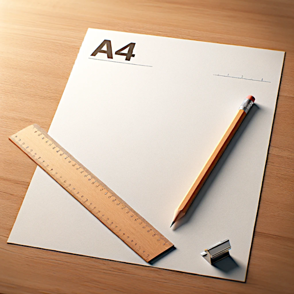

<span style="color:blue;font-weight:bold;font-size:larger;">What is the difference between canvas.width and canvas.clientWidth?</span>

<span style="color:#59acf3;font-size:larger;">hardcore_dany.html</span>

```js
let canvas = renderer.domElement;
let needResize = canvas.width !== canvas.clientWidth ||
                canvas.height !== canvas.clientHeight;
// Set canvas (renderer) size.
```

Sure, let's break it down!

## canvas.width

Think of this like the actual drawing space of your canvas in a digital art program. This is the width (how wide it is) of the area where you can draw or display things. It's measured in pixels and is a part of the canvas itself.

## canvas.clientWidth

This is more about how your canvas looks on the web page. It's the visible width of the canvas element on the screen, including any visible borders or padding. It doesn't include things like scroll bars.

So, if you resize your browser window or change the display settings, `clientWidth` can change, but `canvas.width` stays the same unless you specifically change it in your code.

<span style="color:lime;">So if the **client width changes** &mdash; like we open or close the **dev console** &mdash; then the canvas size needs to be adjusted along with it.</span>

## Imagine

Imagine you're drawing on a tablet. The size of the drawing area (like an A4 paper) is `canvas.width`.

But if you put a frame around your tablet that covers a bit of the screen, <mark>**the visible part of the screen**</mark> is `canvas.clientWidth`. The actual drawing area doesn't change, but what you can see does.

# A4 paper

Here is an image showing what an A4 paper looks like. You can see it lying flat on a wooden desk, with a pencil and a ruler beside it for scale. This should give you a good idea of the standard size and appearance of an A4 paper.



<span style="color:blue;font-size:larger;">Oh!  So it's your standard 8.5 x 11" sheet of paper?</span>

Almost, but not quite. An A4 paper is part of the international standard ISO 216, and its dimensions are slightly different from the 8.5 x 11 inches size you're referring to, which is known as "Letter" size and is more commonly used in the United States and Canada.

The size of A4 paper is 210 x 297 millimeters, or about 8.27 x 11.69 inches. So, it's a bit narrower and slightly longer than the Letter size paper. The difference isn't huge, but it's noticeable, especially if you're trying to fit something designed for one size onto the other.

<br>
