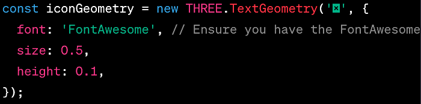

## Add Delete Icon

<span style="color:blue;">Draw ellipse, make X or fontawesome icon appear to delete.</span>

To implement a feature where an "X" or a FontAwesome icon appears where the user stops drawing the ellipse, allowing them to delete it, you will need to make a few modifications to your existing Three.js code. Here's a step-by-step guide to achieve this:

1. **Add FontAwesome to Your Project**: If you haven't already, include FontAwesome in your project. You can do this by adding a link to the FontAwesome CDN in your HTML file.

   ```html
   <link rel="stylesheet" href="https://cdnjs.cloudflare.com/ajax/libs/font-awesome/5.15.1/css/all.min.css">
   ```

2. **Create a Function to Add the Icon**: You'll need a function to create a FontAwesome icon and add it to the scene. This icon will be positioned at the endpoint of the ellipse.

   ```html
   <i class="fa-solid fa-x"></i>
   ```

   ```javascript
   let iconMesh;

   function addIconAtPosition(position) {
     const iconGeometry = new THREE.TextGeometry('X', {
       font: 'FontAwesome', // Ensure you have the FontAwesome font loaded
       size: 0.5,
       height: 0.1,
     });
     const iconMaterial = new THREE.MeshBasicMaterial({ color: 0xff0000 });
     iconMesh = new THREE.Mesh(iconGeometry, iconMaterial);
     iconMesh.position.copy(position);
     scene.add(iconMesh);
   }
   ```

   Note: You might need to load the FontAwesome font using a font loader. This example assumes that you have a way to use FontAwesome as a font in Three.js.

3. **Modify the `onMouseUp` Function**: Update the `onMouseUp` function to add the icon when the user finishes drawing the ellipse.

   ```javascript
   function onMouseUp(event) {
     event.preventDefault();
     isDrawing = false;
     endPoint = getMousePosition(event.clientX, event.clientY);
     updateEllipse();

     // Add the delete icon
     addIconAtPosition(endPoint);
   }
   ```

4. **Implement Icon Click Detection**: Implement a way to detect when the user clicks on the icon. This requires raycasting.

   ```javascript
   renderer.domElement.addEventListener('click', onIconClick, false);

   function onIconClick(event) {
     let mouse = new THREE.Vector2();
     mouse.x = (event.clientX / window.innerWidth) * 2 - 1;
     mouse.y = -(event.clientY / window.innerHeight) * 2 + 1;

     let raycaster = new THREE.Raycaster();
     raycaster.setFromCamera(mouse, camera);

     let intersects = raycaster.intersectObject(iconMesh);
     if (intersects.length > 0) {
       // Icon clicked, remove ellipse and icon
       scene.remove(ellipse);
       scene.remove(iconMesh);
     }
   }
   ```

5. **Handle Ellipse and Icon Removal**: Ensure that when the icon is clicked, both the ellipse and the icon are removed from the scene.

6. **Load the FontAwesome Font**: You might need to load the FontAwesome font using Three.js's `FontLoader` if it's not already available in your Three.js environment.

This implementation provides a basic idea of how to add an interactive icon to your Three.js scene. You might need to adjust the code to fit your specific setup, especially regarding font handling and exact positioning of the icon.



<br>
