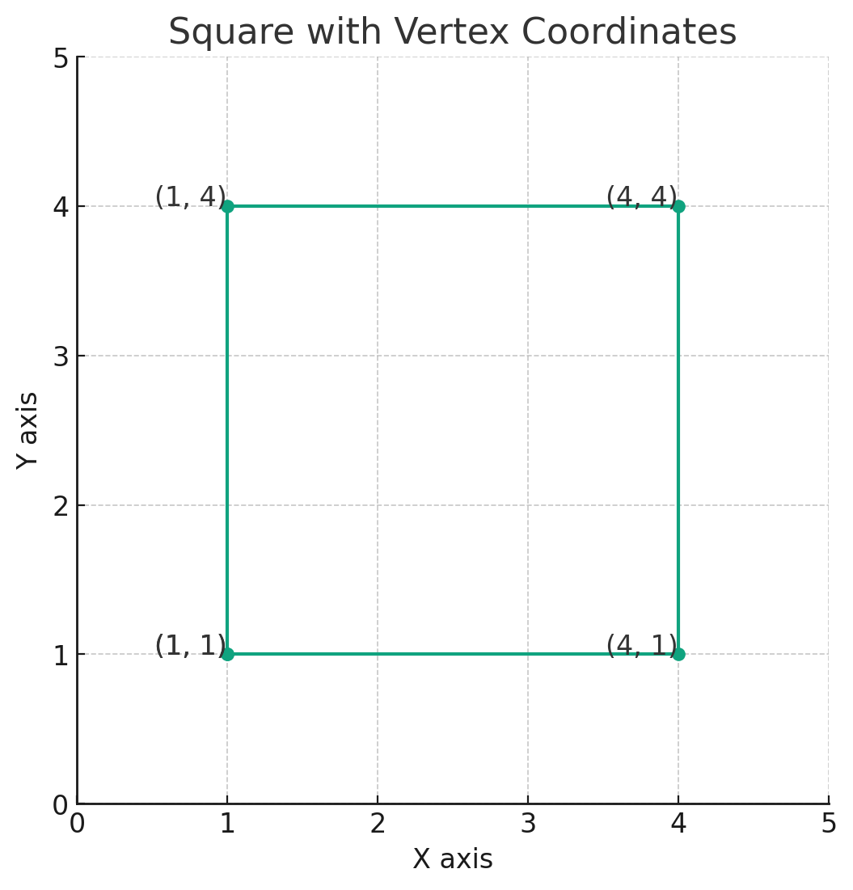

## 3D Rectangle Vertex Layout

<span style="color:blue;font-weight:bold;font-size:larger;">Why are these points are laid out the way they are?</span>

```js
function updateRectangle() {
  let positions = rect.geometry.attributes.position.array;
  positions[0] = startPoint.x;
  positions[1] = startPoint.y;
  positions[2] = startPoint.z;
  positions[3] = endPoint.x;
  positions[4] = startPoint.y;
  positions[5] = startPoint.z;
  positions[6] = endPoint.x;
  positions[7] = endPoint.y;
  positions[8] = startPoint.z;
  positions[9] = startPoint.x;
  positions[10] = endPoint.y;
  positions[11] = startPoint.z;
  rect.geometry.attributes.position.needsUpdate = true;
}
```

The code you provided is for updating the vertices of a rectangle in a 3D space using Three.js. 

In your code, `rect.geometry.attributes.position.array` is an array representing the positions of the vertices of a rectangle.

Here's a breakdown of what each line in the `updateRectangle` function is doing:

1. **positions[0], positions[1], positions[2]:** Set the first vertex at `startPoint` (x, y, z).

2. **positions[3], positions[4], positions[5]:** Set the second vertex. This vertex shares the y and z coordinates with `startPoint`, but uses the x coordinate of `endPoint`. This creates a horizontal edge parallel to the x-axis.

3. **positions[6], positions[7], positions[8]:** Set the third vertex at `endPoint` (x, y, z), but with the z coordinate from the `startPoint`. This creates a vertical edge parallel to the y-axis.

4. **positions[9], positions[10], positions[11]:** Set the fourth vertex. This vertex shares the z coordinate with `startPoint` and the y coordinate with `endPoint`, but uses the x coordinate of `startPoint`. This closes the rectangle, creating the last edge parallel to the x-axis (and back to vertex 1).

Each group of three values in the array (`positions[0] to positions[2]`, `positions[3] to positions[5]`, etc.) represents the x, y, and z coordinates of a vertex of the rectangle in a 3D space. The vertices are laid out in a way that forms the edges of the rectangle between `startPoint` and `endPoint`.

<span style="color:blue;font-weight:bold;">Showing these points in 3D space doesn't help because it ends up looking too complicated.  So...</span>

## Draw square with coordinates.



Here's a diagram of a square with the x,y coordinates for each vertex. The square is defined by the vertices at (1, 1), (1, 4), (4, 4), and (4, 1). The coordinates are annotated on the diagram for clarity.

## And here's the code

```py
import matplotlib.pyplot as plt

# Example square coordinates
square_coordinates = [(1, 1), (1, 4), (4, 4), (4, 1), (1, 1)]  # last point to close the square

# Unzipping the coordinates
x, y = zip(*square_coordinates)

# Creating the plot
plt.figure(figsize=(6, 6))
plt.plot(x, y, marker='o')

# Annotating the coordinates
for i, coord in enumerate(square_coordinates):
    plt.text(coord[0], coord[1], f'{coord}', fontsize=12, ha='right')

# Setting the limits and labels
plt.xlim(0, 5)
plt.ylim(0, 5)
plt.xlabel('X axis')
plt.ylabel('Y axis')
plt.title('Square with Vertex Coordinates')

# Display the plot
plt.grid(True)
plt.show()
```

<br>
