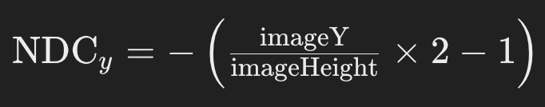

## Reverse this

```js
export function convertToImageCoordinates(positionArray, scene) {
  let dims = getDims(scene);
  let imageWidth = dims.imageWidth;
  let imageHeight = dims.imageHeight;

  const imageCoordinates = [];
  if (imageWidth && imageHeight) {
    for (let i = 0; i < positionArray.length; i += 3) {
      // Extract the x and y coordinates
      let point = {};
      point.x = positionArray[i];
      point.y = positionArray[i + 1];

      // Normalize coordinates to [-1, 1]
      const normalizedX = point.x / (imageWidth / 2);
      const normalizedY = point.y / (imageHeight / 2);

      // Convert normalized coordinates to image coordinates
      const imageX = (normalizedX + 1) * (imageWidth / 2);
      const imageY = (1 - normalizedY) * (imageHeight / 2);

      imageCoordinates.push({ x: imageX, y: imageY });
    }
  }

  return imageCoordinates;
}
```

To convert image coordinates back to Three.js world coordinates, you'll need to perform the inverse of the operations your existing function carries out. This means you'll have to start from the image coordinates, un-normalize them back to the range your Three.js scene uses, and then adjust them based on the scene's dimensions and camera properties.

Given that the input `positionArray` is a flat array of x, y coordinates, and assuming you want to calculate the world positions for a given depth (`z` value), here's how you could write such a function:

```javascript
export function convertToWorldCoordinates(positionArray, scene, camera, depth = 0) {
  let dims = getDims(scene);
  let imageWidth = dims.imageWidth;
  let imageHeight = dims.imageHeight;

  const worldCoordinates = [];
  if (imageWidth && imageHeight && camera) {
    for (let i = 0; i < positionArray.length; i += 2) {
      // Extract the x and y image coordinates
      let imageX = positionArray[i];
      let imageY = positionArray[i + 1];

      // Convert image coordinates to normalized device coordinates (NDC)
      const ndcX = (imageX / imageWidth) * 2 - 1;
      const ndcY = -((imageY / imageHeight) * 2 - 1); // Inverting Y axis

      // Convert NDC to world coordinates
      let vector = new THREE.Vector3(ndcX, ndcY, depth);
      vector.unproject(camera);
      
      worldCoordinates.push(vector.x, vector.y, vector.z);
    }
  }

  return worldCoordinates;
}
```

This function does the following:

1. Converts the image coordinates back to normalized device coordinates (NDC). The range of NDC is [-1, 1] in both x and y axes.
2. Uses the `unproject` method from the THREE.Vector3 class, which requires a camera object. This method converts from NDC back to world coordinates, taking into account the camera's projection matrix. 

Make sure to provide a camera object to this function, as the conversion from 2D back to 3D coordinates depends on the camera's perspective and settings. The `depth` parameter is used to specify the z-coordinate in the Three.js world space, as 2D image coordinates do not contain depth information.

## Depth

The value to pass as `depth` when converting 2D image coordinates back to 3D world coordinates in Three.js is not as straightforward as using `camera.position.z`. The `depth` parameter in this context represents the z-coordinate in the Three.js world space that you want your 2D points to be projected onto. This value doesn't directly correlate to the camera's position in the z-axis but rather to a specific plane in the 3D world where you expect the 2D points to be.

The appropriate value for `depth` depends on your application's requirements. Here are a few strategies to determine it:

1. **Fixed Depth:** If your application involves interacting with objects on a specific plane (e.g., a ground plane), you can set `depth` to the known z-coordinate of that plane.

2. **Depth from an Object:** If you're converting image coordinates to interact with a specific object, you can use the z-coordinate of that object or the average depth of its vertices.

3. **Dynamic Depth Based on Camera:** If you want a more dynamic approach, where the depth adjusts based on the camera's position or orientation, you might calculate `depth` relative to the camera. However, this calculation depends on your scene's scale and how you've set up the camera. For example, you could use a fixed offset from the camera's position:

   ```javascript
   const depth = camera.position.z - someOffset;
   ```

   Where `someOffset` is a value you determine based on how far in front of the camera you want the conversion plane to be.

4. **Using Raycasting:** For more complex or interactive applications, you can use raycasting to find the depth. Cast a ray from the camera through the 2D point and use the intersection with an object or plane in your scene to determine the depth:

   ```javascript
   let raycaster = new THREE.Raycaster();
   let mouse = new THREE.Vector2();

   // Convert screen coordinates to normalized device coordinates (NDC)
   mouse.x = (imageX / imageWidth) * 2 - 1;
   mouse.y = -((imageY / imageHeight) * 2 - 1);

   raycaster.setFromCamera(mouse, camera);

   const intersects = raycaster.intersectObjects(scene.children);
   if (intersects.length > 0) {
       depth = intersects[0].point.z;
   } else {
       depth = defaultDepth; // A fallback depth if no intersection is found
   }
   ```

Each of these strategies has its use cases, and the choice depends on what you're trying to achieve in your Three.js application.

# NDC for y

<span style="color:blue;font-size:larger;">Wouldn't the NDC calculation for y be: `+ 1` ?</span>

For converting image coordinates to normalized device coordinates (NDC), the formula for the y-coordinate should indeed invert the y-axis (since image coordinates usually have the origin at the top-left, while NDC has the origin at the center). However, the correct formula to convert a y-coordinate from image space to NDC is:



This ensures that the value is flipped vertically (due to the negative sign) and normalized to fit within the [-1, 1] range of NDC. The `+ 1` in your question seems to be a mistake; the `- 1` is correct, as it shifts the range from [0, 2] to [-1, 1].

Here's a quick breakdown:

- Divide `imageY` by `imageHeight` to get a normalized value between [0, 1].
- Multiply by 2 to get a value between [0, 2].
- Subtract 1 to shift the range to [-1, 1].
- Apply a negative sign to flip the y-axis, as image coordinates consider the top as 0, whereas in NDC, the origin (0,0) is at the center of the screen with positive y going upwards.

So, the original formulation in the conversion function is correct for the NDC conversion:

```javascript
const ndcY = -((imageY / imageHeight) * 2 - 1);
```

This equation correctly maps the image coordinates to NDC, inverting the y-axis to match the OpenGL/WebGL coordinate system used by Three.js.

<br>
